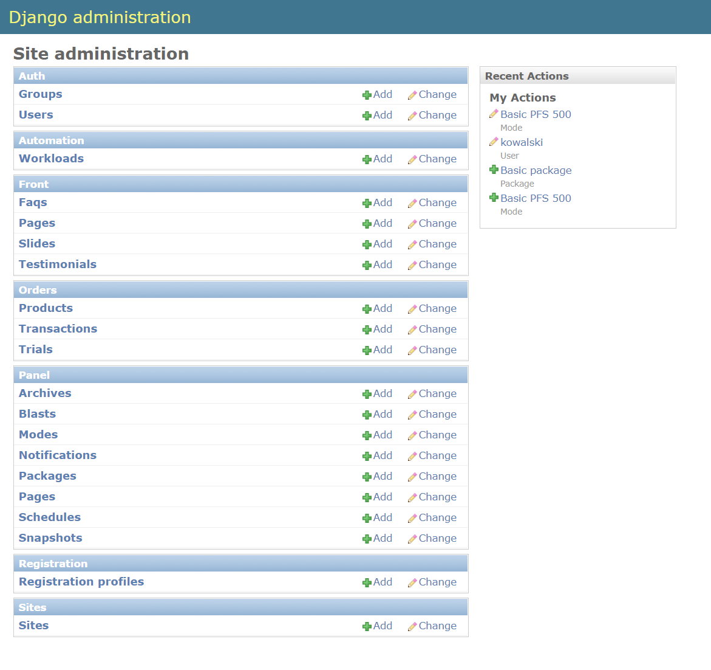
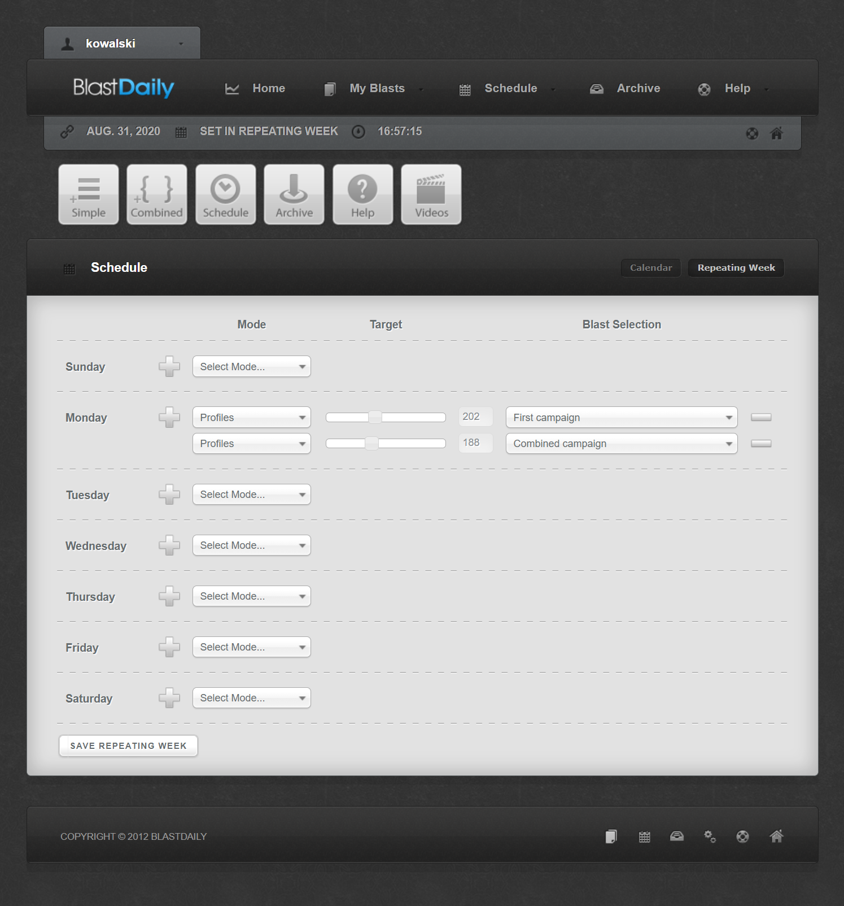

## Project overview

<table>
  <tr>
    <td>Development time:&nbsp;</td>
    <td>4 months</td>
  </tr>
  <tr>
    <td>Development scope:&nbsp;</td>
    <td>From idea to deployment, full stack</td>
  </tr>
  <tr>
    <td>Technology stack:&nbsp;</td>
    <td>Python, Django, JavaScript, PostgreSQL, AWS Services</td>
  </tr>
  <tr>
    <td>Database schema:&nbsp;</td>
    <td>22 Tables</td>
  </tr>
  <tr>
    <td>Source lines of code:&nbsp;</td>
    <td>6,000</td>
  </tr>
</table>

## System administration

- Automated two-way communication between the website and a link building software for MS Windows 
- The ability to design flexible subscription plans based on link types and their quantities
- Integration of subscription plan payments with ClickBank

  

## Client interface

- The ability to create simple campaigns (blasts) for a specific link types, with multiple URLs and keywords
- The ability to create combined campaigns by grouping previously created simple campaigns
- The ability to schedule simple and combined campaigns for specific dates or as recurring week
- The ability to assign specific link numbers for scheduled entries
- The ability to download generated link reports

  
  
  
  
  
  
  
  
  

## Training videos

<iframe src="https://www.youtube.com/embed/g81XCqnbok0" frameborder="0" allow="accelerometer; autoplay; encrypted-media; gyroscope; picture-in-picture" allowfullscreen></iframe>

<iframe width="640" height="400" src="https://www.youtube.com/embed/HNOezP2qHIo" frameborder="0" allow="accelerometer; autoplay; encrypted-media; gyroscope; picture-in-picture" allowfullscreen></iframe>

<iframe width="640" height="400" src="https://www.youtube.com/embed/IQtwsWDiDy8" frameborder="0" allow="accelerometer; autoplay; encrypted-media; gyroscope; picture-in-picture" allowfullscreen></iframe>

<iframe width="640" height="400" src="https://www.youtube.com/embed/WOzLF-T7w4Y" frameborder="0" allow="accelerometer; autoplay; encrypted-media; gyroscope; picture-in-picture" allowfullscreen></iframe>

