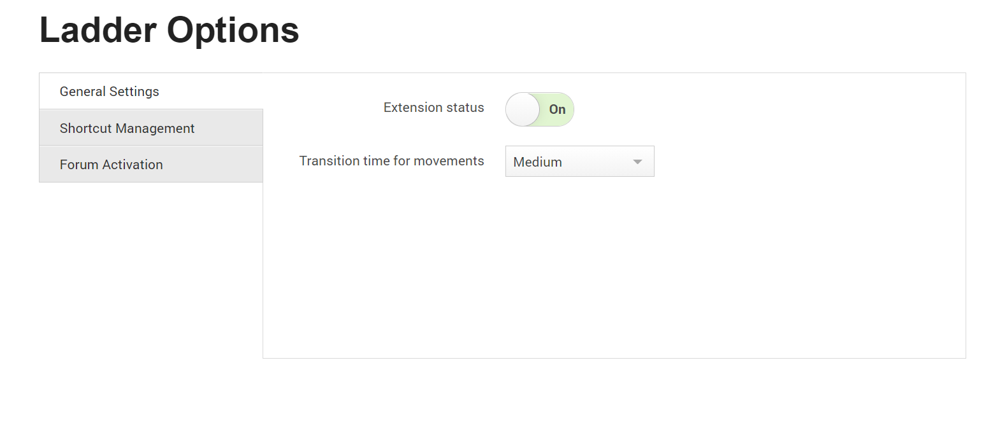
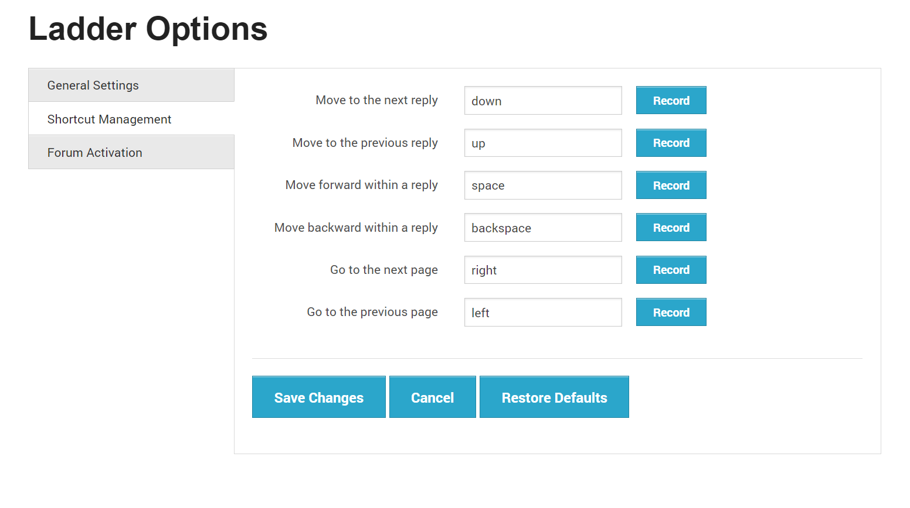
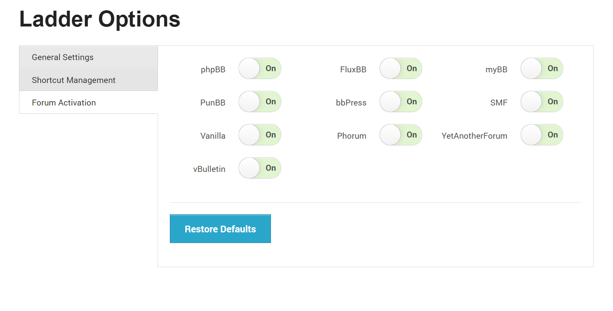

## Project overview

<table>
  <tr>
    <td>Development time:&nbsp;</td>
    <td>2 months</td>
  </tr>
  <tr>
    <td>Development scope:&nbsp;</td>
    <td>From idea to deployment, full stack</td>
  </tr>
  <tr>
    <td>Technology stack:&nbsp;</td>
    <td>JavaScript, ZURB Foundation</td>
  </tr>
  <tr>
    <td>Database schema:&nbsp;</td>
    <td>Local storage</td>
  </tr>
  <tr>
    <td>Source lines of code:&nbsp;</td>
    <td>1,000</td>
  </tr>
</table>

## Functionality

- The ability to record shortcuts
- Support for 6 common movements
- Support for 10 different message board engines
- Setting transition time for recorded movements

<div class="ui small rounded images">
  <a href="../images/lr_01.png" target="_blank"></a>
  <a href="../images/lr_02.png" target="_blank"></a>
  <a href="../images/lr_03.png" target="_blank"></a>
</div>

## Shared data

```
var ladderShared = angular.module('ladderShared', []);
ladderShared.factory('ladderStorage', function () {
    var templates = { 
        'settings': {
            'is_active': { 'value': false, 'label': 'Extension status' },
            'transition': { 
                'value': 500, 
                'label': 'Transition time for movements', 
                'options': [
                    { 'value': 0, 'label': 'Immediate' },
                    { 'value': 200, 'label': 'Fast' },
                    { 'value': 500, 'label': 'Medium' },
                    { 'value': 1000, 'label': 'Slow' }
                ] 
            }
        },
        'forums': {
            'phpbb': { 
                'value': true, 
                'label': 'phpBB', 
                'position': 1, 
                'marks': { 
                    'brand': '#copyright:contains("phpBB"), .copyright:contains("phpBB")', 
                    'posts': 'div.post, table.forumline > tbody > tr', 
                    'next_page': ':contains("Goto page") > a:contains("Next"), .display-options > a:contains("Next")', 
                    'prev_page': ':contains("Goto page") > a:contains("Previous"), .display-options > a:contains("Previous")' 
                } 
            },
            'fluxbb': { 
                'value': true, 
                'label': 'FluxBB', 
                'position': 2,
                'marks': { 
                    'brand': '#poweredby:contains("FluxBB")', 
                    'posts': 'div.blockpost', 
                    'next_page': '.pagelink > a[rel="next"]', 
                    'prev_page': '.pagelink > a[rel="prev"]' 
                }
            },
            'mybb': { 
                'value': true, 
                'label': 'myBB', 
                'position': 3,
                'marks': { 
                    'brand': '#copyright:contains("MyBB Group")', 
                    'posts': 'table[id^="post_"]', 
                    'next_page': '.pagination > a[href^="thread"].pagination_next', 
                    'prev_page': '.pagination > a[href^="thread"].pagination_previous' 
                }
            },
            'punbb': { 
                'value': true, 
                'label': 'PunBB', 
                'position': 4,
                'marks': { 
                    'brand': '#copyright:contains("PunBB")', 
                    'posts': 'div.post', 
                    'next_page': '.paging > a:contains("Next")', 
                    'prev_page': '.paging > a:contains("Previous")' 
                }
            },
            'bbpress': { 
                'value': true,
                'label': 'bbPress',
                'position': 5,
                'marks': { 
                    'brand': 'div#bbpress-forums', 
                    'posts': 'div[class^="post-"]', 
                    'next_page': '.bbp-pagination-links > .next', 
                    'prev_page': '.bbp-pagination-links > .prev' 
                }
            },
            'smf': { 
                'value': true, 
                'label': 'SMF', 
                'position': 6,
                'marks': { 
                    'brand': '.copyright:contains("Simple Machines")', 
                    'posts': '#forumposts > form > div', 
                    'next_page': 'div:contains("Pages") > strong + .navPages', 
                    'prev_page': 'div:contains("Pages") > a.navPages:not(strong ~ a):last' 
                }
            },
            'vanilla': { 
                'value': true,
                'label': 'Vanilla',
                'position': 7,
                'marks': { 
                    'brand': '#Foot:contains("Powered by Vanilla")', 
                    'posts': 'div.Item, li.Item', 
                    'next_page': '#PagerAfter > a[rel="next"]', 
                    'prev_page': '#PagerAfter > a[rel="prev"]' 
                }
            },
            'phorum': { 
                'value': true, 
                'label': 'Phorum', 
                'position': 8,
                'marks': { 
                    'brand': '#footer-plug:contains("Phorum")', 
                    'posts': 'div.message', 
                    'next_page': '.paging > a[title="Next"]', 
                    'prev_page': '.paging > a[title="Previous"]' 
                }
            },
            'yetanotherforum': { 
                'value': true, 
                'label': 'YetAnotherForum', 
                'position': 9,
                'marks': { 
                    'brand': 'div:contains("Yet Another Forum.NET")', 
                    'posts': 'table[class*="postContainer"]', 
                    'next_page': '.yafpager > a[title="Next Page"]', 
                    'prev_page': '.yafpager > a[title="Prev Page"]' 
                }
            },
            'vbulletin': { 
                'value': true, 
                'label': 'vBulletin', 
                'position': 10,
                'marks': {
                    'brand': 'div[id$="copyright"]:contains("vBulletin"), form .smallfont:contains("vBulletin")',
                    'posts': 'li[id^="post_"], li.b-post, table[id^="post"]',
                    'next_page': 'a[rel="next"], a[title^="Next"]',
                    'prev_page': 'a[rel="prev"], a[title^="Prev"]'
                }
            }
        },
        'shortcuts': { 
            'next_reply': { 'value': 'down', 'label': 'Move to the next reply', 'position': 1 },
            'prev_reply': { 'value': 'up', 'label': 'Move to the previous reply', 'position': 2 },
            'in_reply_forward': { 'value': 'space', 'label': 'Move forward within a reply', 'position': 3 },
            'in_reply_backward': { 'value': 'backspace', 'label': 'Move backward within a reply', 'position': 4 },
            'next_page': { 'value': 'right', 'label': 'Go to the next page', 'position': 5 },
            'prev_page': { 'value': 'left', 'label': 'Go to the previous page', 'position': 6 }
        },
    };

    return  {
        getValues: function (template, callback) {
            chrome.storage.sync.get(templates[template], function (obj) {
                callback(obj);
            });
        },
        getTemplateSize: function (template) {
            var key, size = 0;
            for (key in templates[template]) {
                if (templates[template].hasOwnProperty(key)) size++;
            }
            return size;
        },
        removeValues: function (template, callback) {
            var key, keys = [];
            for (key in templates[template]) {
                if (templates[template].hasOwnProperty(key)) {
                    keys.push(key);
                }
            }
            chrome.storage.sync.remove(keys, function () {
                callback();
            });
        },
        setValues: function (model, callback) {
            chrome.storage.sync.set(model, function () {
                callback();
            });
        }
    };
});
```


