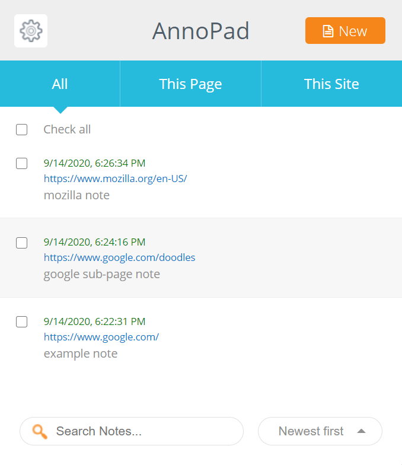
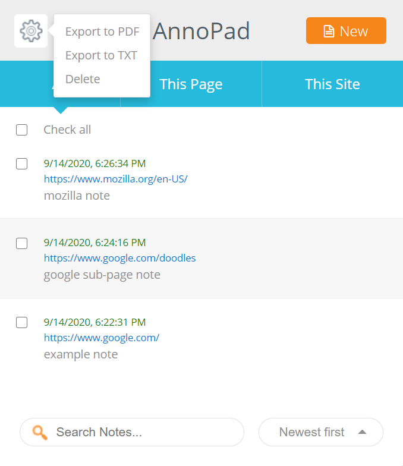
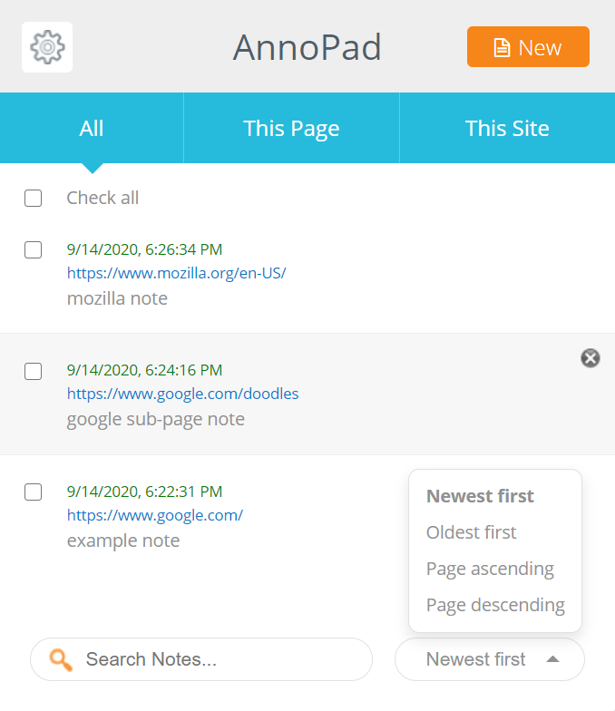
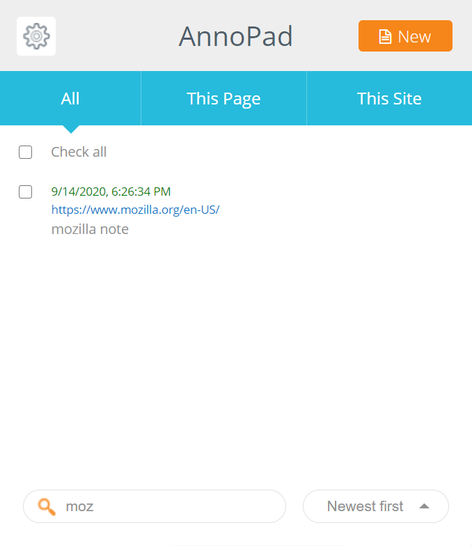
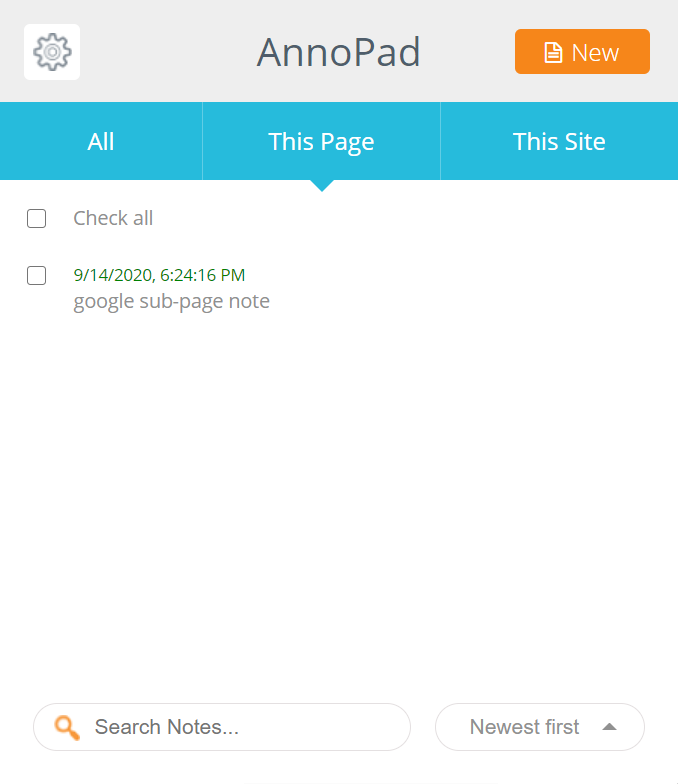
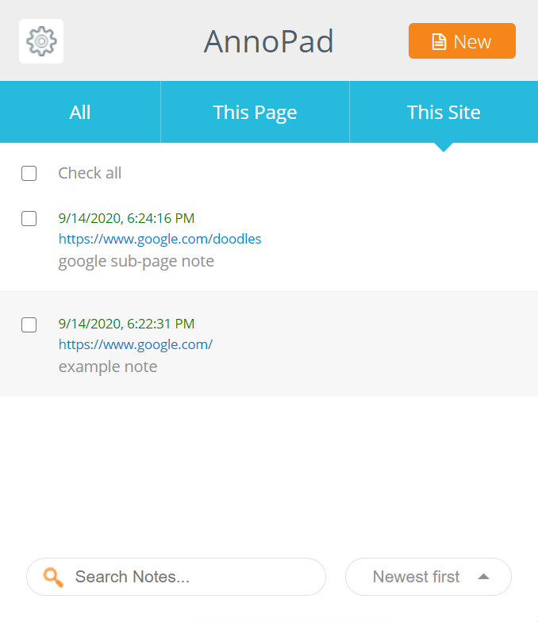
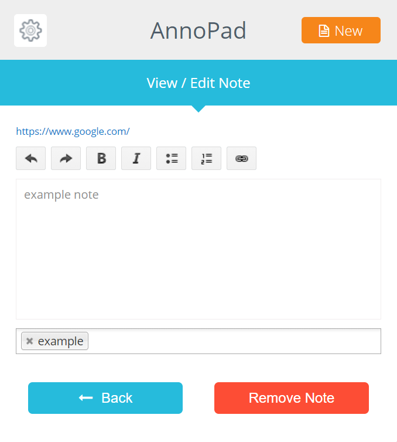

## Project overview

<table>
  <tr>
    <td>Development time:&nbsp;</td>
    <td>2 months</td>
  </tr>
  <tr>
    <td>Development scope:&nbsp;</td>
    <td>From idea to deployment, full stack</td>
  </tr>
  <tr>
    <td>Technology stack:&nbsp;</td>
    <td>JavaScript, AngularJS, Bootstrap</td>
  </tr>
  <tr>
    <td>Database schema:&nbsp;</td>
    <td>Local storage</td>
  </tr>
  <tr>
    <td>Source lines of code:&nbsp;</td>
    <td>2,000</td>
  </tr>
</table>

## Summary

Google Chrome and Firefox extension for adding notes to websites.

## Functionality

- Adding notes to websites and pages
- Adding categories to notes
- Removing and editing the added notes
- Sorting notes by date or alphabetically
- Searching through notes
- The ability to export notes to PDF and plain text

  
  
  
  
  
  
  

