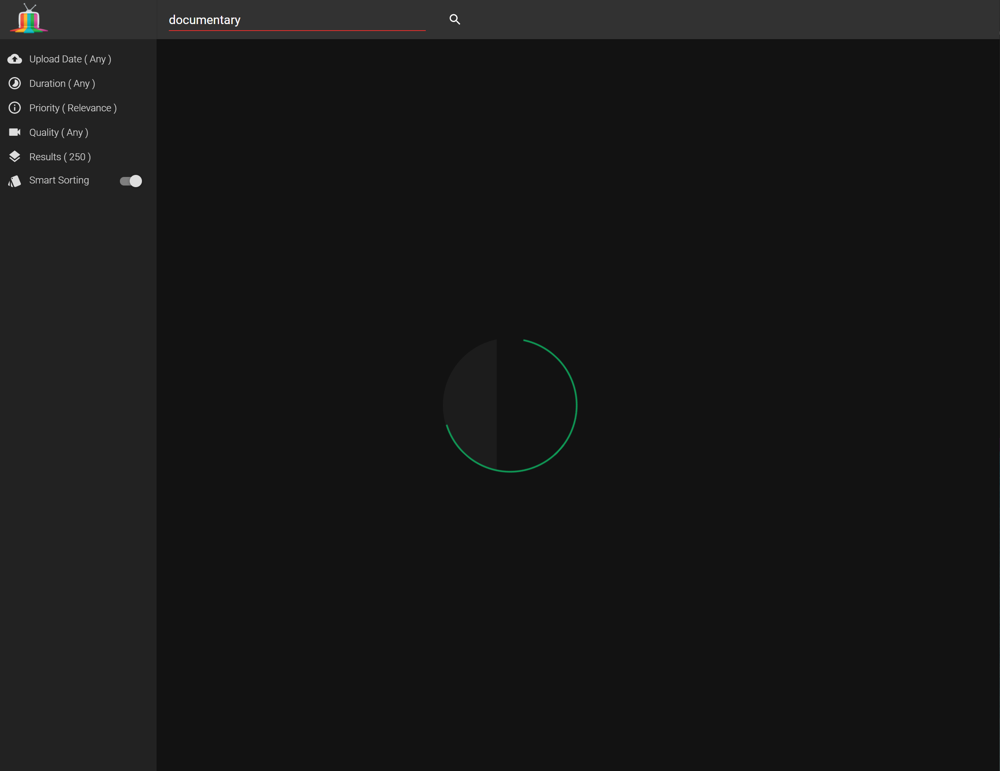
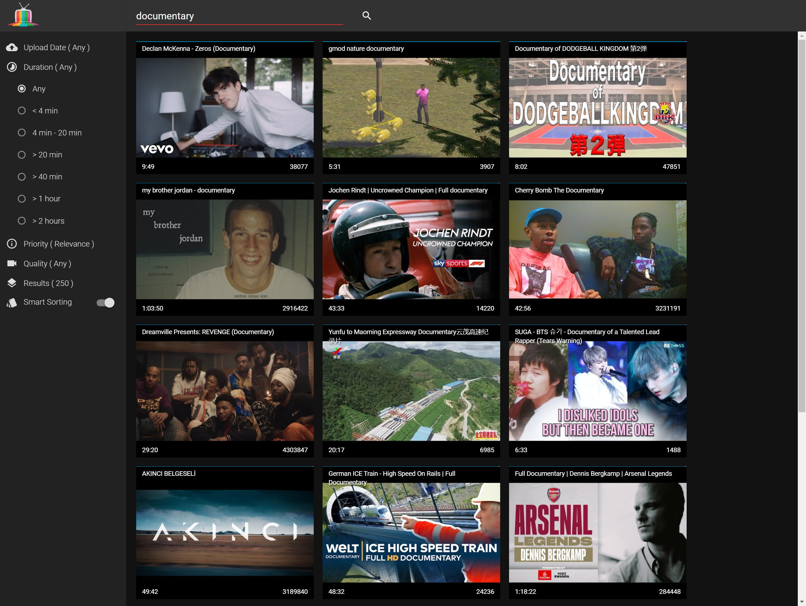
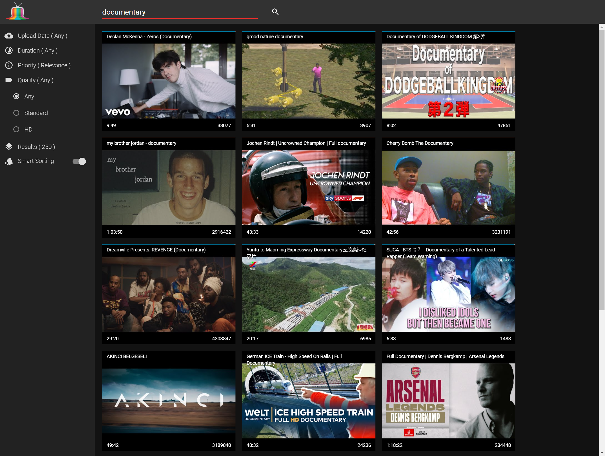

## Project overview

<table>
  <tr>
    <td>Development time:&nbsp;</td>
    <td>1 month</td>
  </tr>
  <tr>
    <td>Development scope:&nbsp;</td>
    <td>From idea to deployment, full stack</td>
  </tr>
  <tr>
    <td>Technology stack:&nbsp;</td>
    <td>JavaScript, AngularJS, Polymer</td>
  </tr>
  <tr>
    <td>Database schema:&nbsp;</td>
    <td>Local storage</td>
  </tr>
  <tr>
    <td>Source lines of code:&nbsp;</td>
    <td>1,300</td>
  </tr>
</table>

## Summary

A search engine with smart sorting for rapid discovery of high quality video content.

## Functionality

- Visual search progress indicator
- Three column design for quick overview of found videos
- Infinite scroll
- Quick preview of videos 
- Basic stats available on each video tile
- Mobile and desktop friendly
- Search filters with the following options:
  - Upload date
  - Duration
  - Priority
  - Quality
  - Number of prefetched results (Results)
  - Smart sorting switch

  
  
  
  
  
  
  

Live demo (limited to 10,000 api calls, which translates to about 60 searches):

[http://motionpicker.uc.r.appspot.com/](http://motionpicker.uc.r.appspot.com/)
