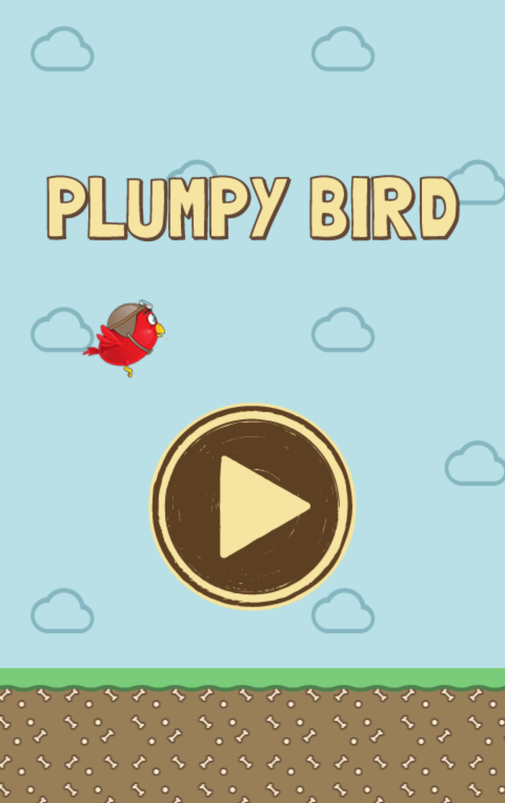

## Project overview

<table>
  <tr>
    <td>Development time:&nbsp;</td>
    <td>1 month</td>
  </tr>
  <tr>
    <td>Development scope:&nbsp;</td>
    <td>From idea to deployment</td>
  </tr>
  <tr>
    <td>Technology stack:&nbsp;</td>
    <td>JavaScript, PhaserJS</td>
  </tr>
  <tr>
    <td>Database schema:&nbsp;</td>
    <td>Local storage</td>
  </tr>
  <tr>
    <td>Source lines of code:&nbsp;</td>
    <td>500</td>
  </tr>
</table>

## Summary

A simple game inspired by the popular Flappy Bird.

  
  
  
  

