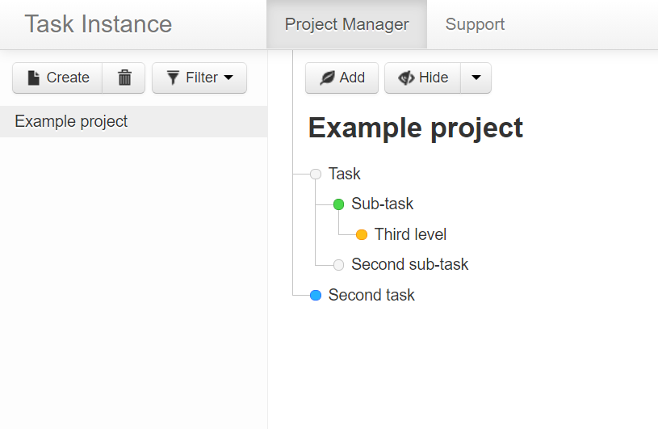
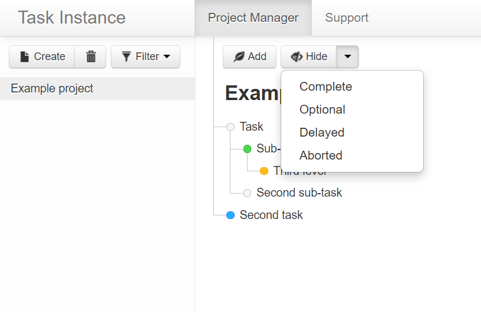
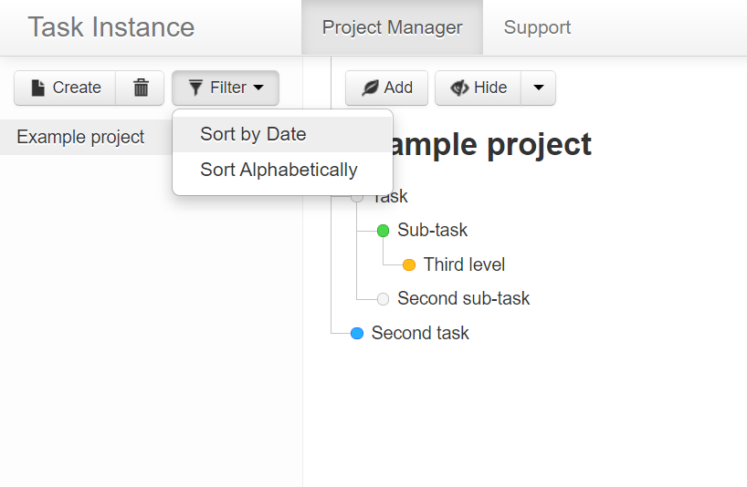
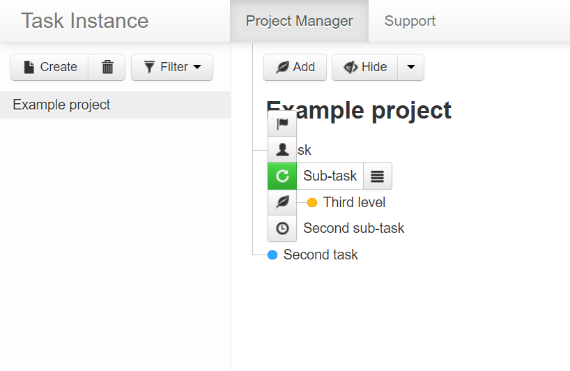
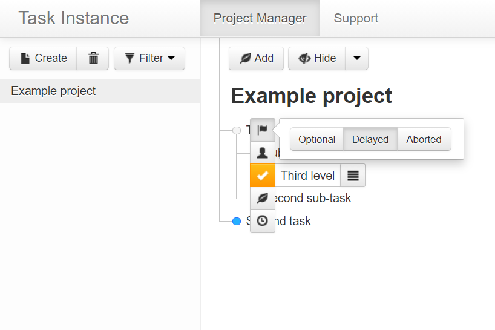
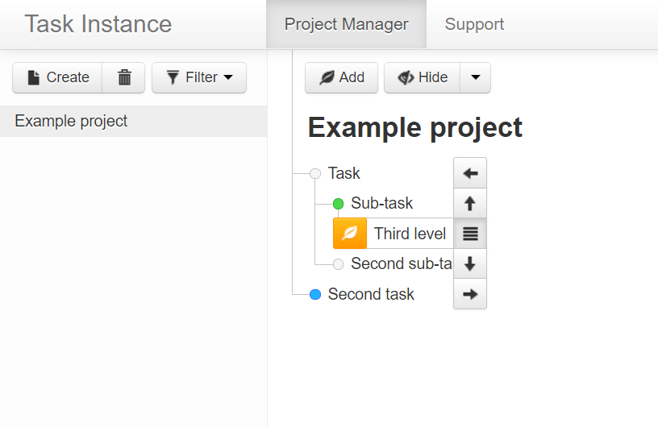
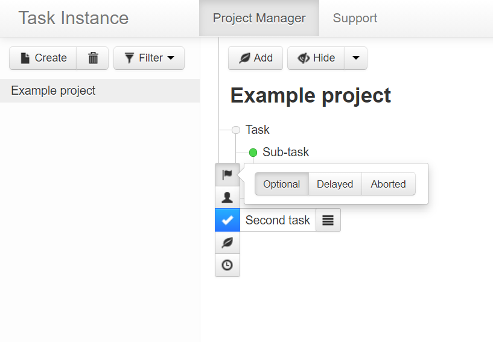
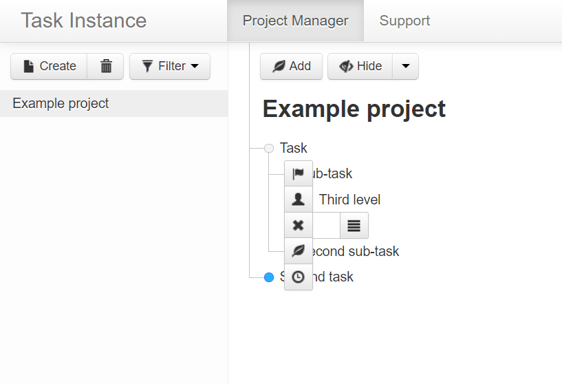
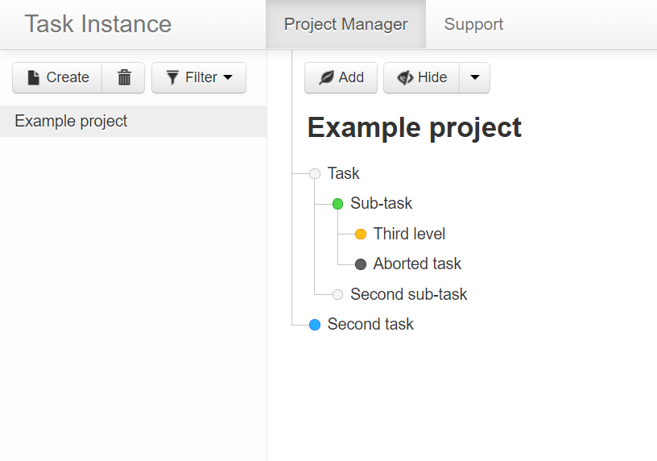
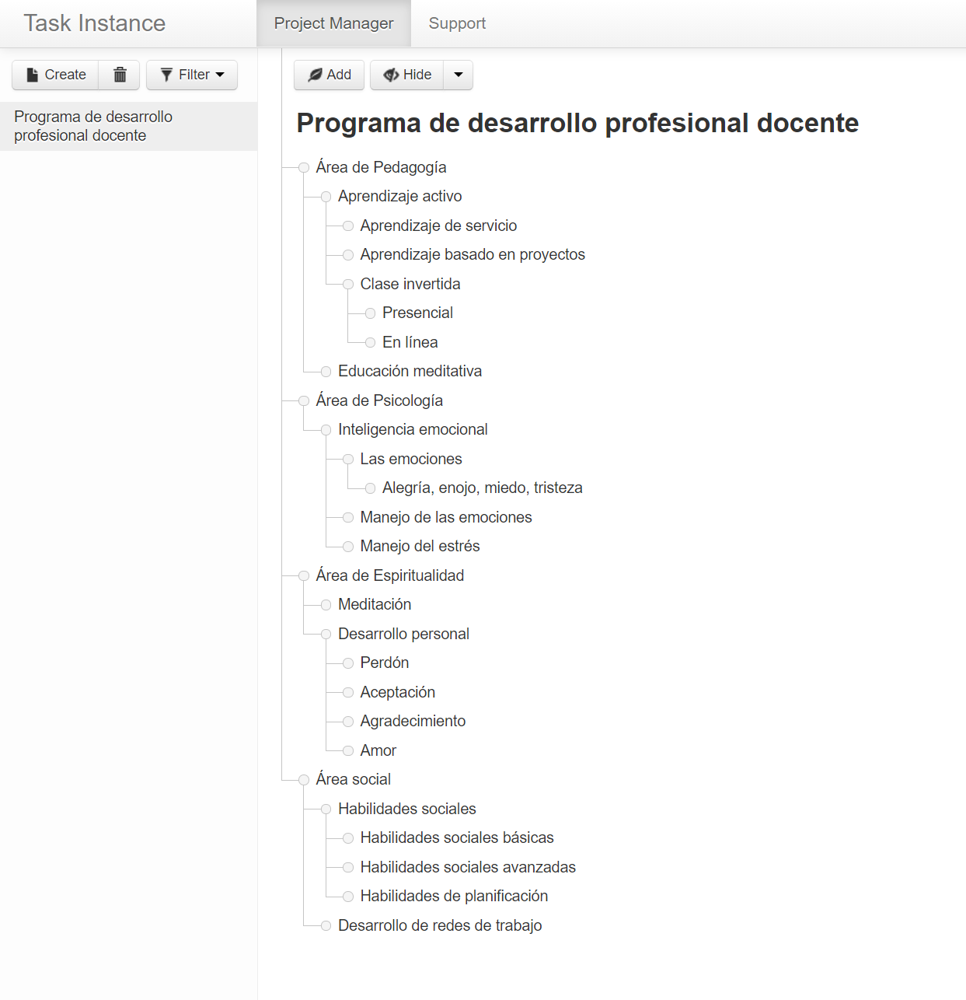

## Project overview

<table>
  <tr>
    <td>Development time:&nbsp;</td>
    <td>2 months</td>
  </tr>
  <tr>
    <td>Development scope:&nbsp;</td>
    <td>From idea to deployment, full stack</td>
  </tr>
  <tr>
    <td>Technology stack:&nbsp;</td>
    <td>Python, JavaScript, AngularJS, Google Cloud</td>
  </tr>
  <tr>
    <td>Database schema:&nbsp;</td>
    <td>3 Kinds of Entities in Google Cloud Datastore</td>
  </tr>
  <tr>
    <td>Source lines of code:&nbsp;</td>
    <td>1,300</td>
  </tr>
</table>

## Summary

A project management application with a tree-like structure of tasks.

## Functionality

- Seamless workflow in desktop and mobile devices
- Adding, editing and removing projects
- Sorting projects by date and alphabetically
- Adding, editing and removing tasks
- Using Flags in tasks
- Indenting tasks
- Hiding tasks based on completion and flags

  
  
  
  
  
  
  
  
  
  

## Live demo 

<a href="https://task-instance.uc.r.appspot.com/" target="_blank">https://task-instance.uc.r.appspot.com/</a>
